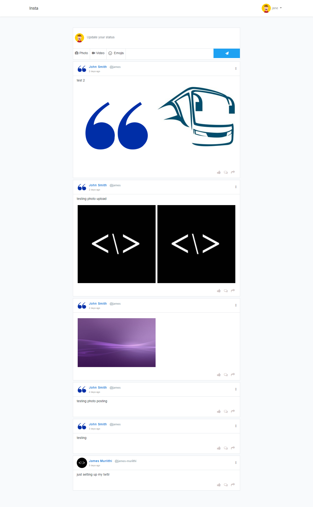

# Lara-social-app

This is a simple web application build on top of the Laravel framework. Users can make posts and see other people posts.

## Screenshot


### Download instructions:

1. Clone the project.

```
git clone https://github.com/james-muriithi/lara-twitter.git projectname
```

2. Install dependencies via composer.

```
composer install 
```

2. Install javascript modules via npm 

```
npm install
```

4. Migrate and seed the Database.

```
php artisan migrate --seed
```

Note: leave terminal open with the command running.

6. Run php server.

```
php artisan serve
```

Enjoy!


### License

The Lara-twitter App is open-sourced software licensed under the [MIT license](http://opensource.org/licenses/MIT)
